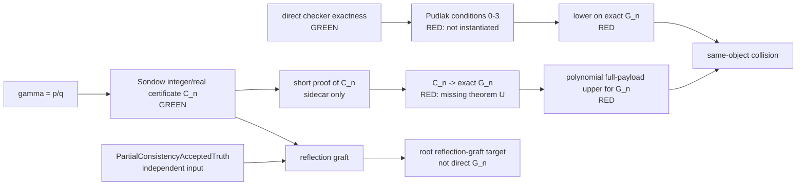

# Sondow--Pudlák 总路线独立审稿审计

审计日期：2026-07-19

审计范围：交接单指定的数学对象、一手文献、当前 Lean 端点和独立精确算术检查。

最终判决：**C——Pudlák 下界的文献条件或对象校准未成立；Sondow 上界另有独立红色缺口。**

## 1. 判决先行

当前仓库已经把直接二元 proof predicate 的标准模型语义校准到真实公开 checker，并且
长度坐标确实是完整 proof tree 加 structural certificate 的 payload。这是重要的绿色
基础。但是下列两个必要桥都没有闭合：

1. 没有对这个精确 `P_direct` 建立 Pudlák 定理 3.1 的内部定量条件 (0)--(3)，也没有
   得到同一 `G_n`、同一 payload 最短长度的下界；
2. Sondow 的有理性证书目标是 number-theoretic/sidecar formula，不是
   `G_n = ¬P_direct(rho_d(n), falsumCode)`，没有到后者的真实 PA proof transformer。

所以不能选择 A。下界本身尚未建立，不能选择 B。虽有一个“强下界不能投影到常数大小
sidecar”的内部 no-go theorem，但这只否决当前退化 sidecar 投影，不证明所有可能的新
上界桥原则上不可能，故总判决不是 D。

## 2. 对象恒等表

表中“相同”要求逐栏相同；仅有自然语言上的同义不计。

| 对象/桥 | formula family | proof system | checker | formula code | proof code | length measure | parameterization | 判定 |
|---|---|---|---|---|---|---|---|---|
| 当前直接谓词 | `compactListedPADirectProofInstance b y` | Foundation `Derivation2 PA` 单边序列演算 | `compactNumericListedPublicVerifier`，逐点等于 listed certified verifier | `Nat`，`compactFormulaCode` | sentinel-packed `Nat`，解码为 listed tree + structural certificate | `Nat.size code - 1`，完整 payload | `b,y` 用短二进制闭项 | 🟢 语义精确 |
| 当前有限一致性 | `compactListedPADirectFiniteConsistencySentence b = ¬P_direct(b,⊥Code)` | 同上 | 同上 | 同一 `compactFormulaCode` | 同上 | 同上 | 数值 cutoff `b` | 🟢 标准模型校准 |
| 目标重标定族 | `G_{d,n}=F_{(n+1)^(dn)}` | 应为同一 `Derivation2 PA` | 应为同一 checker | 应为前述句子的 compact code | 应为同一完整 proof+cert code | 应为同一 payload | 固定 `d`，外层 `n` | 🔴 数学上可定义；仓库无命名端点 |
| 目标最短长度 | `M_d(n)=min payload(G_{d,n})` | 应同上 | 应同上 | 应同上 | 应同上 | 应同上 | 固定 `d` | 🔴 仓库没有组合定义/下界 |
| 旧 `CompactPAProofPredicate` | 旧 compact proof family | `Derivation2 PA` | 结构有效性关系 | 旧 `compactFormulaCode` | `CheckedPAProofTree` | `tree.binaryLength` | `bound` | 🔴 不含公开 structural certificate payload |
| Pudlák 1986 定理 3.1 | `¬P(n,⌜⊥⌝)` | 一致公理化 `A⊇Q` 的论文 proof relation | 由所选算术化定义 | 二字母串的 Gödel code | 二字母 proof string | string/symbol length | `n` 为数值，`|n|` 为二进制长 | 🟡 可实例化的元定理；当前条件未证 |
| Buss 1994 定理 5 | `Con_T((f(n))^c)` | 满足强度条件的 Hilbert-style `T` | 论文固定 proof recognizer | 论文有效编码 | Hilbert proof | total symbol occurrences | time-constructible `f` | 🔴 未校准且主路线非必需 |
| root external Pudlák | `FormulaCode {family,index}` 的 rescaled family | `ProofSystem.PA` 只是标签 | root checker 为 `c = formulaCode` | root structure | `FormulaCode` 自身 | `rootFormulaCodeSize` | abstract scale data | 🔴 不是真实 direct PA proof；含两个 external axioms |
| Sondow 原定理 | `C_n : {log S_n}=d_{2n}I_n` 及整除关系 | 普通数论证明 | 无当前 PA checker | 无当前 compact code | 无当前 proof code | 无当前 payload | `n`，固定有理见证 `p/q` | 🟢 数论结论；🔴 对 `G_n` 无桥 |
| 当前 Sondow sidecar | `polytimeDefinabilityFormula 9001 (...)` / root `sondowCertificateValidCode n` | `BAProofObject BussS21Axiom` | proof-object conclusion relation；局部模型另用 `provesSondowCertificateAt`，无 direct numeric Bool checker | `BAFormula`/root `FormulaCode` | 一节点 `BAProofObject` | `.size = 1` 或 root size convention | `n` | 🔴 干净但错误对象 |
| reflection graft | `sondowReflectionGraftCode n` | root S²₁/PA 标签及条件 embedding | 条件 trace package | root `FormulaCode` | 条件 proof semantics | root `proof_length` | `n` | 🔴 需要独立 partial-consistency truth，仍非 direct `G_n` |

结论：只有表的前两行在 formula/checker/payload 三栏完全锁定。文献下界、root lower、
sidecar upper 和目标 `G_n` 分属不同对象；当前不存在所需方向的显式多项式校准。

## 3. 一手文献逐项对应

### 3.1 Pudlák 1986

一手来源：Pavel Pudlák, *On the length of proofs of finitistic consistency statements
in first order theories*, *Logic Colloquium '84*, Studies in Logic and the Foundations
of Mathematics 120, 1986, pp. 165--196，定理 3.1 在 p. 172。
[作者 PDF](https://users.math.cas.cz/~pudlak/fin-con.pdf)，
[出版记录](https://www.sciencedirect.com/science/chapter/bookseries/pii/S0049237X08704622)，
[DOI](https://doi.org/10.1016/S0049-237X(08)70462-2)。

| 原定理项目 | 当前候选 | 审计 |
|---|---|---|
| `A` 一致且 `Q⊆A` | Foundation PA | PA 强度合适；一致性仅在元理论使用，🟢/🟡 |
| proof/formula 为二字母串；proof 总符号数包含其中公式 | packed listed tree + certificate payload | 可选作新串编码，但必须重证条件；尚无论文编码到当前编码校准，🔴 |
| (0) 内部 bound 单调性 | 外部 `L(c)≤b` 单调 | 外部语义成立；精确二元公式的 PA 内部证明未组装，🟡 |
| (1) proof-to-`P`，界 `p1(n)` | concrete accepted instance compiler | 有真实 proof 构造但无统一 full-payload polynomial theorem，🔴 |
| (2) 内部第二推导条件，界 `p2(|n|,|m|)` | `compileAcceptedDirect` | 后者吃外部真见证，不证明内部蕴含；量词类型不同，🔴 |
| (3) 内部 MP 条件，界 `p3(...)` | 定量 compiler core 的局部 MP | 局部 constructor 未提升为 direct existential/checker/certificate 的内部定理，🔴 |
| 结论：`Con_A(n)` 无 `n^ε` 短 proof | 当前 `F_b` 最短 full payload | 只有前述全部条件及长度恒等后才可转移，🔴 |

印刷页 172 的 (0) 字面方向与“证明长度至多 x”及 Proposition 3.4 不一致；这不是
OCR 误读，且检索未找到正式勘误。详见纸面判决第 3.1 节。严格应用必须显式声明并重证
更正版本；采用自然的向上单调解释也不会消除当前的内部形式化义务。原结论字面是
“不存在任何 `n∈ω` 有 `n^ε` 短证明”，不是仅 eventually；后者只是本路线所需的较弱
推论。论文的编码背景还假定代入等语法运算可高效编码，并要求 $Q$ 对所需编码等式
有多项式长度证明；当前 payload 实例化也必须支付这些成本。

### 3.2 Buss 1994

一手来源：Samuel R. Buss, *On Gödel's theorems on lengths of proofs I: Number of
lines and speedup for arithmetics*, *JSL* 59(3), 1994, pp. 737--756；定理 5 在
p. 742 陈述、p. 743 给出证明梗概。
[作者 PDF](https://mathweb.ucsd.edu/~sbuss/ResearchWeb/godelone/paper.pdf)，
[出版记录](https://www.cambridge.org/core/product/identifier/S0022481200019496/type/journal_article)，
[DOI](https://doi.org/10.2307/2275906)。

该定理针对一致且可有效算术化元数学的 `T`（例如扩定义后包含 `S^1_2` 或
`IΔ0+Ω1`）、多项式时间可识别的公理化、短二进制项和 Hilbert symbol length。对
time-constructible `f`，它给出 `Con_T((f(n))^c)` 的 `f(n)^ε` 下界。当前主路线若先
真正实例化 Pudlák 定理，再用完美幂 `rho_d`，已经不需要 Buss 的推广。把 Buss 直接
用于当前 direct 对象反而新增 Hilbert/sequent、formula family、checker 与
symbol/full-payload 四项校准；这些均不存在。原定理还明确说明：若偏 time constructor
在 `n` 处未定义，则相应实例完全不可证。

### 3.3 Sondow 2003

一手来源：Jonathan Sondow, *Criteria for Irrationality of Euler's Constant*,
*Proc. AMS* 131(11), 2003, pp. 3335--3344；定理 4、5 的陈述在 p. 3340，
定理 5 的证明续至 p. 3341。
[AMS PDF](https://www.ams.org/journals/proc/2003-131-11/S0002-9939-03-07081-3/S0002-9939-03-07081-3.pdf)，
[arXiv](https://arxiv.org/abs/math/0209070)，
[DOI](https://doi.org/10.1090/S0002-9939-03-07081-3)。

文献给出

```text
log(S_n) - d_(2n) I_n
  = d_(2n) A_n - d_(2n) binom(2n,n) gamma,
d_(2n) A_n ∈ Z,
```

取 `gamma=p/q` 为既约表示且 `q>0`。论文的 Lemma 3 给出
`1<d_(2n)<8^n` 与 `0<I_n<16^(-n)`，故 `0<d_(2n)I_n<1`；并证明在
`n≥ceil(q/2)` 时 `q | d_(2n)`，从而最终 `{log S_n}=d_(2n)I_n`。此时可写出整数

```text
z_n = d_(2n) A_n - (d_(2n)/q) binom(2n,n) p,
```

使 `log(S_n)-d_(2n)I_n=z_n`。`gamma=p/q` 是外部解析假设，不是有限整数 checker
本身可验证的字段。文献没有提到 PA 有限一致性、当前 checker 或 proof payload。
仓库中 `SondowForwardReproof` 闭合的是解析恒等式；随后
`SondowShortProofReproof` 才把有理性导向 root Sondow certificate 的最终接受。这个
两文件链忠实于文献，却没有改变目标公式为 direct `G_n`。

## 4. 依赖与循环图



图中没有一条从 Sondow 证书自然流向 `G_n` 的边。reflection graft 通过输入
`PartialConsistencyAcceptedTruth` 把 partial consistency 作为独立字段加入，并且终点
仍是 root formula family；它不能被当作 Sondow 单独产生有限一致性的证明。若这个字段
反过来由所需上界或最终碰撞提供，就形成循环。

## 5. 当前 Lean 对象的只读审计

### 5.1 已核对的绿色端点

* `FoundationCompactNumericListedDirectProofPredicateExactness.lean`：
  `directProofPredicate_iff_exists_publicVerifier` 与
  `compactListedPADirectProofFormula_iff_exists_publicVerifier` 逐字给出
  `∃ proofCode, packedPayloadLength proofCode ≤ bound ∧ publicVerifier = true`。
* `FoundationCompactListedCertifiedVerifier.lean`：listed checker 接受可投影为真实
  `Derivation2 PA {formula}`。
* `FoundationCompactNumericListedPublicVerifier.lean`：numeric checker 与 listed checker
  点态相等。
* `FoundationSuccinctFiniteConsistencyTarget.lean`：`packedPayloadLength code = Nat.size code - 1`。
* `FoundationCompactNumericListedDirectFiniteConsistencyTarget.lean`：`F_b` 是上述精确
  direct instance 的否定；标准模型语义等价于同一 checker 的有限一致性。
* `FoundationCompactBinaryNumeralTerm.lean`：短二进制数词的值和长度界。
* `FoundationPudlakBussRescaledLowerBoundGate.lean`：`rho_d` 和载体的纯算术；其 lower
  structure 的 `eventually_lower` 字段本身就是待证下界。

### 5.2 名称存在但不能解除义务的端点

* `compileAcceptedDirect` 从一个**外部给定的具体真接受见证**产生 exact positive
  instance 的真实 PA proof；没有该输出 full payload 的统一固定多项式界，也不是
  Pudlák (2) 的 PA 内部蕴含。
* `FoundationCompactPAQuantitativeCompilerCore` 有真实 axiom、specialization、MP、
  conjunction、exists 等 constructor 和局部界；没有把它们组装为 direct predicate
  的 (0)--(3)。
* `FoundationCompactNumericListedDirectExplicitWitnessPAPayload.lean` 已构造真 proof 与
  resource 形状，但其注释明确把 public polynomial bound 留作剩余定量义务；全仓未
  找到后续闭合端点。
* `PudlakBussPerfectPowerRescaledLowerBound` 接收 `eventually_lower`，没有产生它的
  constructor/provider；且其 `source` 与长度用的是 root `FormulaCode/proof_length`，
  不是 direct `F_b/M_d`。

### 5.3 明确的错误对象与 no-go

root `rootProofCodeSemantics` 的 checker 是 `c = code`，所以 root `proof_length` 被定义
为 `rootFormulaCodeSize`；源码注释也禁止把它当作未经校准的 PA/Hilbert proof length。
`ExternalPudlakRawEncoding.lean` 的最终 external lower 依赖两个显式 axiom，并未连接到
direct checker。

Sondow sidecar 把 `polytimeDefinabilityFormula ...` 直接列作 toy bounded-arithmetic
axiom，故一节点 proof 的 size 精确等于 1。这能给错误目标一个完全真实的常数上界，
却不能给 `G_n` 上界。仓库甚至证明：若 theorem-5 source 真有强超多项式 lower，则
不存在 `source ≤ sidecar + 2` 的 advertised projection。这个 no-go 是对当前 sidecar
拼接的明确否决，不是 Euler 常数路线一切可能形式的反例。

## 6. 九项压力测试

| 测试 | 做法与证据 | 结果 |
|---|---|---|
| 1. 公式族错位 | 展开 direct `G_n`、Sondow `C_n`、sidecar 和 reflection-graft syntax/code | 🔴 只有 `G_n` 含 `¬P_direct(rho,⊥Code)`；无语法等式 |
| 2. 信息流 | 询问 `S_n,I_n,d_(2n)` 如何排除所有短 PA 矛盾 proof codes | 🔴 无回答；缺同对象归约 U |
| 3. 替换 | 把 Sondow 证书替换成 `2+2=4` 等短证书 | 🔴 若仍推出有限一致性，则所用通则过强 |
| 4. 空真/不可实现 | 检查 lower+constant-sidecar projection 的联合包 | 🔴 已有 theorem 证明二者不能同时构造；其他 remaining-obligation structures 也无 provider |
| 5. 循环 | 标注 rationality、partial consistency、lower、collision 的依赖 | 🔴 reflection graft 独立要求 partial-consistency truth；不得由目标回填 |
| 6. 度量 | 比较 symbol count、tree binary length、root size、full payload | 🔴 文献/root/old predicate 均未校准到 full payload |
| 7. 一致性 | 区分标准模型 `F_b` 为真与 PA 内部有短 proof | 🟢 区分明确；🔴 上界不能使用元 `Con(PA)` 作为内部公理 |
| 8. 均匀性 | 多项式系数允许依赖固定 `p,q,d`，不得依赖 `n` | 🟡 纯算术满足；逻辑 compiler 没有相应固定多项式 theorem |
| 9. 公开难题审稿 | 若 lower 与 U 同时成立即证明 `gamma` 无理 | 🔴 U 必须按新突破审查，不能称作标准编译细节 |

## 7. 独立算术检查与反例

计算检查只覆盖纯算术，不覆盖 PA 内部可证性或对象恒等。实际运行

```bash
python3 scripts/foundational_mathematical_validity_checks_sympy.py
```

使用 Python 3.12.3、SymPy 1.14.0，退出码 0。没有使用浮点。Wolfram Engine 在本机
不存在，`.wls` 已生成但状态为黄色未运行。完整输入、输出、版本、SHA-256 和未解表达式
见 `foundational_mathematical_validity_computer_check_log_zh.md`。

精确有限反例包括：`d=0` 时 `rho_d` 不严格增加；零次幂不反射次序；非严格 lower
不能推出严格目标；把 `ceil(q/2)` 换成 `floor` 失败；`n=0` 时位长界必须有常数项；
`rho` 的数值不能压到其 bit length；底数为 0 时指数单调性需额外条件。所有无界纯算术
结论另有纸面证明；有限搜索均标为 `SAMPLE_ONLY`，没有冒充定理。

## 8. 十二个最强审稿反驳

| # | 反驳 | 正文中的回答 | 状态 |
|---:|---|---|---|
| 1 | 这条路线若轻易成立就解决著名公开难题，桥在哪里？ | 纸面证明“缺失定理 U”逐字给出所需 builder、checker acceptance 和 payload bound | 🔴 U 未证 |
| 2 | Sondow 证明的不是 `G_n` | 纸面证明第 5、6 节展开两条完整公式；对象表逐栏比较 | 🔴 无 reduction |
| 3 | 当前系统并非文献的 Hilbert system | 纸面证明第 1.1 节列出 `Derivation2` 十种规则；对象表单列 Buss Hilbert system | 🔴 无长度模拟 |
| 4 | proof symbols 与 full payload 被混用 | 纸面证明第 1.3 节固定 `Nat.size-1`；对象表分别列四种度量 | 🔴 外部 lower 未校准 |
| 5 | “checker 可算”不等于 PA 内有短证明 | 纸面证明第 3.2 节分开外部接受、内部蕴含、payload polynomial | 🔴 (2) 未证 |
| 6 | MP constructor 是否真的在同一 direct predicate 内闭合？ | 第 3.2 节说明局部 MP 尚未提升到 existential witness/checker/certificate theorem | 🔴 (3) 未证 |
| 7 | `rho` 数值巨大，公式本身是否也巨大？ | 引理 3.1 后注给出 binary numeral 长度 `O(d n log(n+1))`；SymPy 日志检验方向 | 🟢 纯算术 |
| 8 | 标准模型真值是否被偷作 PA 内部一致性？ | 纸面证明第 1.6 节隔离元一致性；明确 `models_...` 不是 certified proof | 🟢 已揭露，upper 仍缺 |
| 9 | sidecar 的短 proof 是否只是把目标列为 axiom？ | Lean 审计确认 toy `polytimeDefinabilityFormula` 为 axiom、proof size=1 | 🔴 错误对象 |
| 10 | external theorem structure 是否只是把结论作为字段？ | lower gate 的 `eventually_lower` 正是目标字段；external route 另有两个显式 axiom | 🔴 无 provider |
| 11 | 最短长度函数是否真的就是目标 `M_d`？ | 当前 `minListed...` 对空集返回 0，且仓库无 `G_d/M_d` 组合；纸面定义用 `+∞` 处理空集 | 🔴 需 existence/identity lemma |
| 12 | Pudlák 论文是否已经替项目构造自然算术化？ | 一手文献在定理后说明不构造特定算术化；条件须逐项验证 | 🔴 不可由引用代替 |

这些反驳中，绿色回答只保护定义与算术；任何红色项都足以阻断 A/B 结论。

## 9. 红/黄/绿总表

| 义务 | 颜色 | 理由 |
|---|---|---|
| numeric/listed public checker 与 direct formula 标准语义 | 🟢 | exact iff 已有内核定理 |
| checker 接受到真实 `Derivation2 PA` | 🟢 | soundness 端点存在 |
| 完整 payload 定义与 canonical packing | 🟢 | `Nat.size-1` 及编码同步已有 |
| `F_b` 的标准模型有限一致性语义 | 🟢 | exact iff 与元一致性证明已有 |
| `rho_d` 完美幂算术、阈值、指数取整 | 🟢 | 纸面证明；SymPy 独立检查相容 |
| direct (0) 内部单调性 | 🟡 | 常规但未组装；只有外部/旧谓词版本 |
| direct (1) fixed-polynomial full-payload compiler | 🔴 | qualitative proof 有，公开 polynomial bound 缺失 |
| direct (2) 内部第二推导条件 | 🔴 | external true-instance compiler 量词不匹配 |
| direct (3) 内部 MP 条件 | 🔴 | 只有局部 constructor，无统一 direct theorem |
| Pudlák proof-string 到当前 full payload 校准 | 🔴 | 无显式模拟 |
| exact `G_d/M_d` 下界 | 🔴 | 仓库无定义/provider；现 gate 仅假设 lower |
| Sondow number-theoretic certificate | 🟢 | 原文定理明确，仓库 checked tail 与之同向 |
| Sondow certificate 的 sidecar 短证明 | 🟡 | 对它自己的 toy target 是真，但与目标无关 |
| Sondow 到 exact `G_n` 的 builder/reduction | 🔴 | 完全缺失；与 exact lower 合用将构成突破 |
| 同一 checker/full-payload 的多项式上界 | 🔴 | 无 proof tree/certificate/acceptance/bound |
| 同对象 collision | 🔴 | lower、upper 均未闭合 |

## 10. 纸面 lemma 到 Lean 定义/端点映射

| 纸面对象或 lemma | 当前 Lean 对应 | 状态 |
|---|---|---|
| `PA` 与单边序列演算 | `FoundationSuccinctFiniteConsistencyTarget.PA`; `LO.FirstOrder.Derivation2` | 已有内核定义 |
| listed proof tree / certificate | `ListedCheckedPAProofTree`; `StructuralValidityCertificate` | 已有内核定义 |
| `V(c,y)` | `compactNumericListedPublicVerifier` | 已有内核定义 |
| `L(c)` | `packedPayloadLength` | 已有内核定义 |
| `P_direct` | `compactListedPADirectProofFormula` / `CompactListedPADirectProofPredicate` | 已有内核定义 |
| 引理 2.1 exactness | `compactListedPADirectProofFormula_iff_exists_publicVerifier` | 已有内核定理 |
| checker soundness | `listedCompactCertifiedPAProofVerifier_toDerivation` 加 pointwise equality | 已有内核定理 |
| `F_b` | `compactListedPADirectFiniteConsistencySentence` | 已有内核定义 |
| `F_b` 标准语义 | `models_compactListedPADirectFiniteConsistencySentence_iff` | 已有内核定理 |
| `G_{d,n}` | 将 `pudlakBussPerfectPowerScale d n` 代入 exact `F_b` | 需要新增定义/lemma |
| `M_d(n)` | `minListedCertifiedPAProofPayloadLength G_{d,n}`，还需 existence 处理 | 需要新增定义/lemma |
| Pudlák (0) exact direct | 无 | 尚未证明 |
| Pudlák (1) full-payload polynomial | qualitative compiler + local bounds | 尚未证明 |
| Pudlák (2) exact direct | 无 | 尚未证明 |
| Pudlák (3) exact direct | local MP only | 尚未证明 |
| 引理 3.1 纯算术 | lower gate 中有 carrier/scale 算术，但 endpoint 用 root source | 纯算术已有；direct 应用未证 |
| Sondow `gamma` rational checked tail | `SondowForwardReproof`（恒等式）+ `SondowShortProofReproof`（证书接受） | 已有，但依赖一手数学且目标不同 |
| 缺失定理 U | 无 | 尚未证明；与 exact lower 合用将构成突破 |

## 11. 内核探针、源码扫描与公理画像

由于纸面证明没有闭合，按交接单规则**没有创建**
`integration/FoundationSondowPudlakMathematicalValidityGateProbe.lean`。只读审计没有运行
完整 `lake build`；探针没有向仓库写入 artifact，只编译单个现有文件或 `/dev/stdin`
输入，并读取现有源文件中的同类输出。

下面是实际成功运行的命令及全部不重复的相关 `#print axioms` 输出；所有命令
exit code 0。

### 11.1 direct exactness

```bash
lake env lean integration/FoundationCompactNumericListedDirectProofPredicateExactness.lean
```

```text
'FoundationCompactNumericListedDirectProofPredicateExactness.directProofPredicate_recovers_semanticAcceptance' depends on axioms: [propext,
 Classical.choice,
 Quot.sound]
'FoundationCompactNumericListedDirectProofPredicateExactness.directProofPredicate_iff_exists_publicVerifier' depends on axioms: [propext,
 Classical.choice,
 Quot.sound]
'FoundationCompactNumericListedDirectProofPredicateExactness.compactListedPADirectProofFormula_iff_exists_publicVerifier' depends on axioms: [propext,
 Classical.choice,
 Quot.sound]
```

### 11.2 `F_b` 的精确性与标准真值

```bash
lake env lean integration/FoundationCompactNumericListedDirectFiniteConsistencyTarget.lean
```

```text
'FoundationCompactNumericListedDirectFiniteConsistencyTarget.compactListedPADirectProofInstance_formulaValue_iff' depends on axioms: [propext,
 Classical.choice,
 Quot.sound]
'FoundationCompactNumericListedDirectFiniteConsistencyTarget.compactListedPADirectProofInstance_iff_exists_publicVerifier' depends on axioms: [propext,
 Classical.choice,
 Quot.sound]
'FoundationCompactNumericListedDirectFiniteConsistencyTarget.compactListedPADirectFiniteConsistencySentence_piOne' depends on axioms: [propext,
 Classical.choice,
 Quot.sound]
'FoundationCompactNumericListedDirectFiniteConsistencyTarget.models_compactListedPADirectFiniteConsistencySentence_iff' depends on axioms: [propext,
 Classical.choice,
 Quot.sound]
'FoundationCompactNumericListedDirectFiniteConsistencyTarget.models_compactListedPADirectFiniteConsistencySentence' depends on axioms: [propext,
 Classical.choice,
 Quot.sound]
```

### 11.3 最短完整 payload

```bash
lake env lean integration/FoundationCompactListedMinProofLength.lean
```

```text
'FoundationCompactListedMinProofLength.listedCertifiedPayloadLength_exists_of_derivation' depends on axioms: [propext,
 Classical.choice,
 Quot.sound]
'FoundationCompactListedMinProofLength.minListedCertifiedPAProofPayloadLength_spec_of_derivation' depends on axioms: [propext,
 Classical.choice,
 Quot.sound]
'FoundationCompactListedMinProofLength.minListedCertifiedPAProofPayloadLength_le_of_accept' depends on axioms: [propext,
 Classical.choice,
 Quot.sound]
'FoundationCompactListedMinProofLength.listedCertifiedPAProofOf_toDerivation' depends on axioms: [propext,
 Classical.choice,
 Quot.sound]
'FoundationCompactListedMinProofLength.minListedCertifiedPAProofPayloadLength_realized_of_derivation' depends on axioms: [propext,
 Classical.choice,
 Quot.sound]
```

定义本身另用只读 stdin 探针：

```bash
sed '$a #print axioms FoundationCompactListedMinProofLength.minListedCertifiedPAProofPayloadLength' \
  integration/FoundationCompactListedMinProofLength.lean | lake env lean /dev/stdin
```

前五段与上面相同，新增输出为：

```text
'FoundationCompactListedMinProofLength.minListedCertifiedPAProofPayloadLength' depends on axioms: [propext,
 Classical.choice,
 Quot.sound]
```

### 11.4 `rho` 与条件 lower gate

```bash
lake env lean integration/FoundationPudlakBussRescaledLowerBoundGate.lean
```

```text
'eventually_lt_pudlakBussGrowthCarrier' depends on axioms: [propext, Classical.choice, Quot.sound]
'PudlakBussPerfectPowerRescaledLowerBound.toStrongRescaledLowerBound' depends on axioms: [propext,
 Classical.choice,
 Quot.sound]
'not_polynomial_bound_pudlakBussPerfectPowerScale' depends on axioms: [propext, Classical.choice, Quot.sound]
'no_polynomialCofinalScale_pudlakBussPerfectPowerScale' depends on axioms: [propext, Classical.choice, Quot.sound]
```

这里第二行只是“给定含 `eventually_lower` 字段的 structure 后”的包装 theorem；干净
画像不构造该字段。

### 11.5 sidecar 的精确常数长度与 no-go

```bash
lake env lean integration/SondowProjectSondowUpperCompilerRoute.lean
```

相关 `#check`/`#print axioms` 的逐字输出为：

```text
SondowMainCheckedCodeBridge.SondowProjectSondowUpperCompilerRoute.sidecarSondowCertificateTargetMeasured_eq_one
  (n : ℕ) : sidecarSondowCertificateTargetMeasured n = 1
'SondowMainCheckedCodeBridge.SondowProjectSondowUpperCompilerRoute.sidecarSondowCertificateTargetMeasured_eq_one' depends on axioms: [propext,
 Classical.choice,
 Quot.sound]
SondowMainCheckedCodeBridge.SondowProjectSondowUpperCompilerRoute.sidecarSondowCertificateTargetMeasured_polynomial :
  is_polynomial_bound fun n => ↑(sidecarSondowCertificateTargetMeasured n)
'SondowMainCheckedCodeBridge.SondowProjectSondowUpperCompilerRoute.sidecarSondowCertificateTargetMeasured_polynomial' depends on axioms: [propext,
 Classical.choice,
 Quot.sound]
SondowMainCheckedCodeBridge.SondowProjectSondowUpperCompilerRoute.no_sidecarSondowCheckedTargetProjection_of_strongLowerBound
  {scale_data : InternalPudlakTheorem5ScaleData}
  {sem : ProofCodeSemantics (InternalPudlakTheorem5PowerBoundRelevantCode scale_data)}
  (hlower :
    ∀ (f : ℕ → ℝ),
      is_polynomial_bound f →
        ∃ᶠ (n : ℕ) in Filter.atTop, ↑(sem.minProofCodeSize (scale_data.powerBoundRawCode n) ⋯) > f n) :
  ¬InternalPudlakTheorem5CheckedTargetProjection scale_data sem sidecarSondowCertificateTargetMeasured
'SondowMainCheckedCodeBridge.SondowProjectSondowUpperCompilerRoute.no_sidecarSondowCheckedTargetProjection_of_strongLowerBound' depends on axioms: [propext,
 Classical.choice,
 Quot.sound]
```

其中 `⋯` 是 Lean `#check` pretty-printer 的原样输出，不是审计删节。

closed trace 与 closed S²₁ upper 使用下列 stdin 探针：

```bash
awk '1; END { print "#print axioms SondowMainCheckedCodeBridge.SondowProjectSondowUpperCompilerRoute.SondowCheckedS21TraceCompiler.closed"; print "#print axioms SondowMainCheckedCodeBridge.SondowProjectSondowUpperCompilerRoute.s21SondowLinearUpper_fromHalfDenCheckedTailClosed"; print "#print axioms SondowMainCheckedCodeBridge.SondowProjectSondowUpperCompilerRoute.s21SondowCertificateUpper_fromHalfDenCheckedTailClosed" }' \
  integration/SondowProjectSondowUpperCompilerRoute.lean | lake env lean /dev/stdin
```

除重复上面的源码自带输出外，新增输出为：

```text
'SondowMainCheckedCodeBridge.SondowProjectSondowUpperCompilerRoute.SondowCheckedS21TraceCompiler.closed' depends on axioms: [propext,
 Classical.choice,
 Quot.sound]
'SondowMainCheckedCodeBridge.SondowProjectSondowUpperCompilerRoute.s21SondowLinearUpper_fromHalfDenCheckedTailClosed' depends on axioms: [propext,
 Classical.choice,
 Quot.sound]
'SondowMainCheckedCodeBridge.SondowProjectSondowUpperCompilerRoute.s21SondowCertificateUpper_fromHalfDenCheckedTailClosed' depends on axioms: [propext,
 Classical.choice,
 Quot.sound]
```

这些是“干净的错误对象”：终点仍是 sidecar Sondow family，不是 direct `G_n`。

### 11.6 external Pudlák 输入及 build-artifact 差异

```bash
printf '%s\n' 'import EulerLimit.ExternalPudlakRawEncoding' \
  '#print axioms literaturePudlakTheorem5ExternalScaleData' \
  '#print axioms literaturePudlakTheorem5ExternalRescaledLowerBound' \
  '#print axioms literaturePudlakTheorem5ExternalRescaledLowerBoundCertificate' \
  '#print axioms literaturePudlakTheorem5ExternalPowerBoundLowerBound' \
  '#print axioms literaturePudlakTheorem5ExternalLowerBoundCertificate' \
  | lake env lean /dev/stdin
```

```text
'literaturePudlakTheorem5ExternalScaleData' depends on axioms: [literaturePudlakTheorem5ExternalScaleData,
 propext,
 Classical.choice,
 Quot.sound]
'literaturePudlakTheorem5ExternalRescaledLowerBound' depends on axioms: [literaturePudlakTheorem5ExternalRescaledLowerBound,
 literaturePudlakTheorem5ExternalScaleData,
 proof_length,
 propext,
 Classical.choice,
 Quot.sound]
'literaturePudlakTheorem5ExternalRescaledLowerBoundCertificate' depends on axioms: [literaturePudlakTheorem5ExternalRescaledLowerBound,
 literaturePudlakTheorem5ExternalScaleData,
 proof_length,
 propext,
 Classical.choice,
 Quot.sound]
'literaturePudlakTheorem5ExternalPowerBoundLowerBound' depends on axioms: [literaturePudlakTheorem5ExternalRescaledLowerBound,
 literaturePudlakTheorem5ExternalScaleData,
 proof_length,
 propext,
 Classical.choice,
 Quot.sound]
'literaturePudlakTheorem5ExternalLowerBoundCertificate' depends on axioms: [literaturePudlakTheorem5ExternalRescaledLowerBound,
 literaturePudlakTheorem5ExternalScaleData,
 proof_length,
 propext,
 Classical.choice,
 Quot.sound]
```

当前源码中的 `ProofComplexityCore.lean` 已把 `proof_length` 改成由 identity-style root
semantics 诱导的定义；直接编译当前源码的只读探针为：

```bash
awk '1; END { print "#print axioms proof_length"; print "#print axioms proof_length_eq_rootFormulaCodeSize"; print "#print axioms rootSemanticProofLength_eq_rootFormulaCodeSize" }' \
  EulerLimit/ProofComplexityCore.lean | lake env lean /dev/stdin
```

```text
'proof_length' depends on axioms: [propext, Classical.choice, Quot.sound]
'proof_length_eq_rootFormulaCodeSize' depends on axioms: [propext, Classical.choice, Quot.sound]
'rootSemanticProofLength_eq_rootFormulaCodeSize' depends on axioms: [propext, Classical.choice, Quot.sound]
```

因此前一个 import 探针中的 `proof_length` 依赖来自现存 `.olean` 依赖图与当前源码的
build-artifact 差异；本任务禁止完整 build，故没有重建依赖图来掩盖这一事实。无论按旧
`.olean` 还是当前源码理解，external certificate 都保留两个同名 literature axioms；
而当前源码的 root length 又只是 identity checker 下的 formula-code size，不是 direct
PA payload。两个版本都不能供应目标 lower。

需要强调：即便某个条件 theorem 的公理画像只含 `propext`、`Classical.choice`、
`Quot.sound`，也只说明“从其输入字段到结论”的推导干净，不说明输入字段有 constructor。
反之，external Pudlák route 的两个核心输入在源码中就是显式 `axiom`。

源码扫描结论：交接单列出的 14 个关键 Lean 文件中未发现 `sorry`、`admit` 或
Lean `opaque` 声明；`ExternalPudlakRawEncoding.lean` 第 643 行注释中的英文单词
`opaque` 是唯一同词命中，不是声明。该文件明确存在
`literaturePudlakTheorem5ExternalScaleData` 和
`literaturePudlakTheorem5ExternalRescaledLowerBound` 两个 axiom。缺口主要表现为错误
对象、条件 structure 无 provider、或定量 theorem 缺失，而不是隐藏的 `sorry`。

## 12. 最小缺失定理与最终建议

下界的最小 direct endpoint 可写成：存在固定 `d>0,N`，使

```text
∀ n ≥ N,
  (n+1)^n <
    minListedCertifiedPAProofPayloadLength
      (compactListedPADirectFiniteConsistencySentence
        (pudlakBussPerfectPowerScale d n)).
```

但这个 endpoint 不能直接设为 axiom；其证明必须先给出 exact direct predicate 的
Pudlák (0)--(3)、固定多项式和 full-payload 校准。这里的大部分工作属于艰难但看起来
原则上常规的定量内部化；在完成前，总判决保持 C。

上界的最小 endpoint 必须从固定 `gamma=p/q` 构造同一公式的真实
`CertifiedPAProof`，并给出 checker acceptance 及统一 fixed-polynomial full-payload
界。Sondow certificate 到这个有限一致性句的逻辑 reduction 目前没有依据；若与下界
一并完成就会证明 Euler 常数无理，因而应视为新数学突破，不是接口补丁。

在这两个 endpoint 都存在以前，不应新增数学闸门探针，不应把 root/sidecar
`proof_length` 投影为 direct `M_d`，也不应对外宣称完成 Sondow--Pudlák collision。
